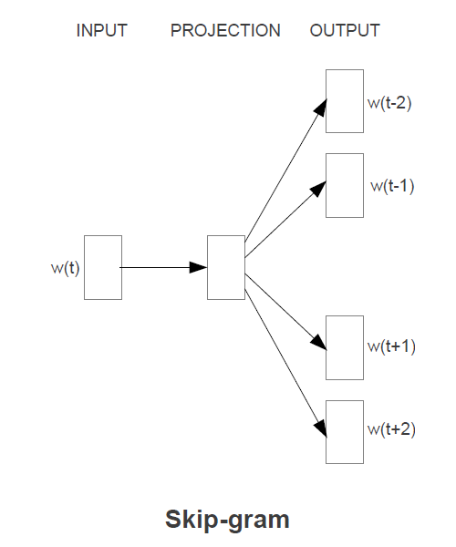
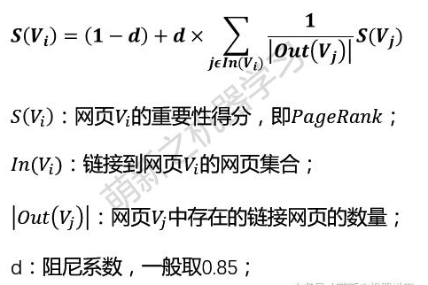

# 文本建模  
> **1.向量空间模型**  
> 向量空间模型(VSM)使用词袋模型(词袋模型基于一元文法统计模型)表示方法将词表示成one-hot向量，该模型假设文档之间是相互独立的，词语之间也是相互独立的将文本映射成高维的特征向量，利用特征空间向量来表示文本  
>  
> **2.浅层语义分析模型**  
>  浅层语义分析模型(LSA),构造一个文档与词语的关系矩阵，矩阵的行表示词语，矩阵的列则表示文档，矩阵中元素的值表示该词语出现在该文档中的次数，也可以使用词语在文档中的权重来给矩阵中的元素赋值。使用PCA降维对文档与词语的关系矩阵进行降维，使得文档中相似的词合并掉  
>  
> **3.文档主题模型**  
> 文档主题模型(LDA)从语义出发，在词语和文档的关系之外，引入了主题词的概念，增加了词语和主题词的关系，主题词和文档的关系。该模型要指定文档主题的数量，即文本语料中包含有多少个主题，通过对文本语料的训练，给出每个文本属于每个主题的概率，以及文本中的每个词语属于每个主题的概率。  
# 词频分析
> **pip install nltk**  
> **pip install matplotlib**  
>('会议', 6182)  
>('电话', 4136)  
>('需求', 2488)  
>('视频会议', 2263)  
>('试用', 2176)  
>('购买', 2143)  
>('注册', 2117)  
>('收费', 1945)  
>('支持', 1882)  
>('联系', 1825)  
>('下载', 1812)  
>('系统', 1718)  
>('账号', 1678)  
>('软件', 1665)  
>('电话会议', 1609)  
>('参加', 1599)  
>('邮箱', 1585)  
>('手机', 1531)  
>('电脑', 1415)  
>('视频', 1378)  
>('测试', 1349)  
>('销售', 1187)  
>('接入', 1074)  
>('报价', 1021)  
>('呼叫', 995)  
>('咨询', 993)  
>('参会', 939)  
>('终端', 882)  
>('产品', 846)  
>('负责人', 834)  
>('网络', 822)  
>('申请', 796)  
>('帐号', 785)  
>('登录', 763)  
>('中心', 741)  
>('方', 738)  
>('链接', 728)  
>('网页', 713)  
>('人数', 695)  
>('操作', 690)  
>('问题', 690)  
>('密码', 690)  
>('会议室', 686)  
>('硬件', 644)  
>('官网', 589)  
>('行业', 560)  
>('免费', 560)  
>('买', 552)  
>('功能', 551)  
>('点击', 540)  
>  
> 
# Word2Vec词向量训练  
>  **pip install gensim**  
> 构建三层神经网络，分别是输入层，隐藏层,softmax输出层。对词进行one-hot编码，输入网络训练，词向量训练结果为词one-hot向量与网络隐藏层中间权重矩阵相乘  
> **1.skip-gram算法**  
>   
>  
> **2.CBOW算法**  
>   
> **"产品"的相似词**(1,300)向量  
>   
>平台 0.7766879796981812  
>业务 0.7454820275306702  
>解决方案 0.7286168336868286  
>服务 0.7222141027450562  
>软件 0.7052211761474609  
>方案 0.6947022676467896  
>系统 0.6891728639602661  
>功能 0.6855509281158447  
>智能 0.6630642414093018  
>代理 0.6596889495849609  
# 高频词聚类(意图分析) 
> **pip install sckit-learn**    
> **k-means聚类算法**    
>第1类：  ['手机', '电脑', '网页']  
>第2类：  ['买', '购买']  
>第3类：  ['邮箱']  
>第4类：  ['会议']  
>第5类：  ['免费', '问题']  
>第6类：  ['中心', '电话会议', '硬件', '视频会议']  
>第7类：  ['需求']  
>第8类：  ['负责人', '销售']  
>第9类：  ['官网', '密码', '点击', '登录', '链接']  
>第10类：  ['人数']  
>第11类：  ['电话']  
>第12类：  ['产品', '功能', '支持', '系统', '网络', '视频', '软件']   
>第13类：  ['联系']  
>第14类：  ['下载', '操作']  
>第15类：  ['帐号', '账号']  
>第16类：  ['测试', '试用']  
>第17类：  ['接入', '终端']  
>第18类：  ['行业']  
>第19类：  ['注册', '申请']  
>第20类：  ['收费']  
>第21类：  ['参加']  
>第22类：  ['报价']  
>第23类：  ['会议室', '参会', '方']  
>第24类：  ['呼叫']  
>第25类：  ['咨询']  
# 关键词提取  
> **pip install jieba**
>## **TF-IDF**算法
> **关键字的提取严重依赖预料库**  
> TF=(词在文档中出现的次数)/(文章总词数)
> IDF=log(语料库中文档综述/(包含该词的文档数+1))
> TF-IDF= TF*IDF  
> TF-IDF值越大，则这个词成为一个关键词的概率就越大  
> ## **TextRank**算法  
> 1.先对文档分词,分词结束词性标注处理，并过滤掉一些停用词，保留我们需要的词性的单词，名词或者动词或形容词  
>  
> 2.将上述我们需要的词语构建一个关键词图，其中词语为图的节点，然后通过共现关系构造任意两点之间的边，两个节点之间存在边仅当他们对应的词汇在长度为k的窗口中共现，K表示窗口的大小，即一个窗口单词的个数默认是5  
>  
> 3.根据PageRank原理中的衡量重要性的公式，初始化各节点的权重，然后迭代计算各节点的权重，直至收敛
>   
> 4.对节点权重进行排序，选取得分最高的几个作为候选关键词
# 依存文法分析  
> 1.一个句子中只有一个成分是独立的  
>  
> 2.其它成分直接依存于某一成分  
>  
> 3.任何一个成分都不能依存与两个或两个以上的成分  
>  
> 4.如果A成分直接依存于B成分，而C成分在句中位于A和B之间，那么C或者直接依存于B，或者直接依存于A和B之间的某一成分  
>  
> 5.中心成分左右两面的其它成分相互不发生关系  
>  
># 举例
>  主谓关系&nbsp;&nbsp;SBV&nbsp;(subject-verb)&nbsp;&nbsp;我送她一束花 (我 <-- 送)  
>  
>  动宾关系&nbsp;&nbsp;VOB&nbsp;(verb-object)&nbsp;&nbsp;我送她一束花 (送 --> 花)  
>  
>  间宾关系&nbsp;&nbsp;IOB&nbsp;(indirect-object)&nbsp;&nbsp;我送她一束花 (送 --> 她)  
>  
> 前置宾语&nbsp;&nbsp;FOB&nbsp;(fronting-object)&nbsp;&nbsp;他什么书都读 (书 <-- 读)  
>  
>  并列关系&nbsp;&nbsp;COO&nbsp;(coordinate)&nbsp;&nbsp;大山和大海 (大山 --> 大海)  
>  
>  定中关系&nbsp;&nbsp;ATT&nbsp;(attribute)&nbsp;&nbsp;红苹果 (红 <-- 苹果)  
>  
> 兼语&nbsp;&nbsp;DBL&nbsp;(double)&nbsp;&nbsp;他请我吃饭 (请 --> 我)  
# 句向量  
> 1.对句子中的所有词的词向量进行加权平均(每个词向量的权重为**a/(a+p(w))**  
> **a** 代表参数，**p(w)** 代表词w的频率(相对整个预料的频率，不是指相对句子的频率)  
>  
> 2.使用[PCA算法](https://github.com/siwanghu/Machine-Learning/blob/master/%E4%B8%BB%E6%88%90%E5%88%86%E5%88%86%E6%9E%90.pdf)对生成的句向量降维  
>   
> 参考论文[A Simple but Tough-to-Beat Baseline for Sentence Embeddings](https://openreview.net/pdf?id=SyK00v5xx)  
